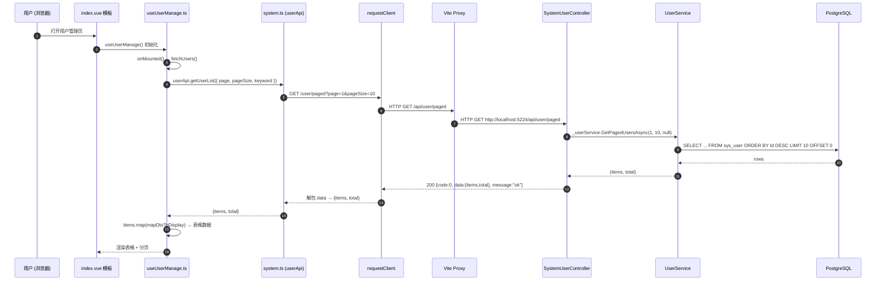
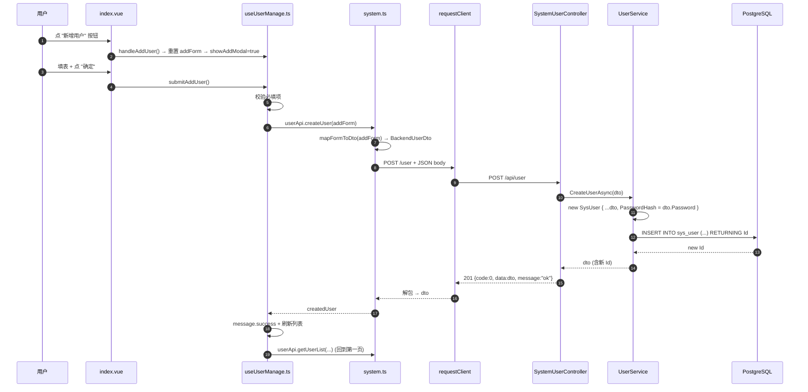
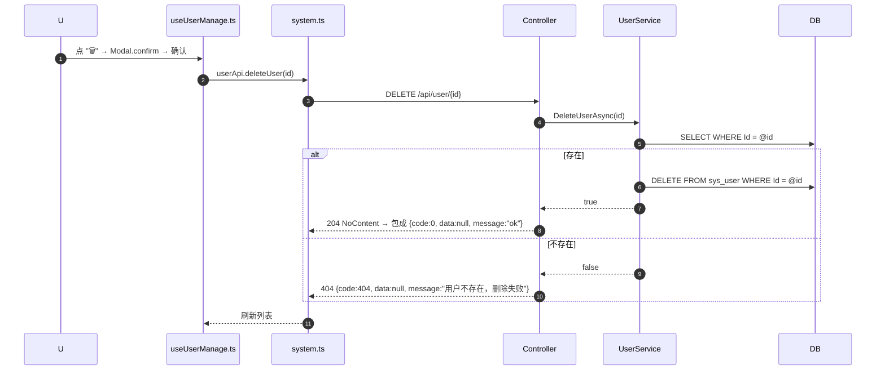
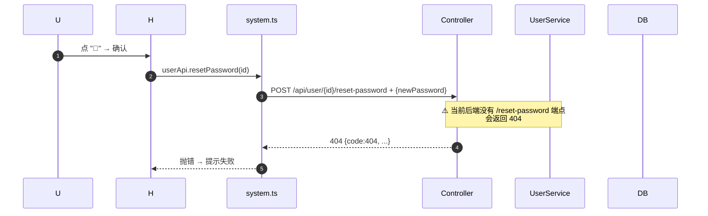

# 用户管理 — 前后端交互流程

> 适用版本：当前 `E:\5HP_Project` 仓库
> 链路：Vue3 (Vben Admin) 前端 → Vite 代理 → ASP.NET Core 8 Web API → EF Core → PostgreSQL

---

## 1. 整体架构

```
┌─────────────────────────────────────────────────────────────────────┐
│                          浏览器 (Vben Admin)                         │
│  视图: views/vision-archive/system/user/index.vue                    │
│  Hook: views/vision-archive/system/user/useUserManage.ts             │
└──────────────────────────┬──────────────────────────────────────────┘
                           │ 调用 userApi.xxx()
                           ▼
┌─────────────────────────────────────────────────────────────────────┐
│  API 包装层 (前端)                                                    │
│  src/api/vision-archive/system.ts                                   │
│  - 统一前缀 /api/user/...                                            │
│  - mapFormToDto(): 表单中文 → 后端 DTO（数字 ID）                     │
│  - mapDtoToDisplay(): 后端 DTO → 表格行展示对象                        │
└──────────────────────────┬──────────────────────────────────────────┘
                           │ requestClient (axios + 拦截器)
                           │ baseURL = /api
                           ▼
┌─────────────────────────────────────────────────────────────────────┐
│  Vite 开发代理 (vite.config.ts)                                       │
│  /api/*  →  http://localhost:5224/api/*                              │
│  rewrite: 去掉路径开头的 /api                                          │
└──────────────────────────┬──────────────────────────────────────────┘
                           │ HTTP (JSON over UTF-8)
                           ▼
┌─────────────────────────────────────────────────────────────────────┐
│  ASP.NET Core 8 Web API                                              │
│  Controllers/SystemUserController.cs                                 │
│    - [Route("api/user")]                                             │
│    - 依赖注入 IUserService                                            │
│                                                                       │
│  全局过滤器:                                                            │
│    Filters/ResultWrapperFilter.cs    ← 统一包成 {code,data,message}   │
│    Filters/GlobalExceptionFilter.cs  ← 兜底异常                       │
└──────────────────────────┬──────────────────────────────────────────┘
                           │ 业务调用
                           ▼
┌─────────────────────────────────────────────────────────────────────┐
│  应用层 (Application)                                                  │
│  Services/UserService.cs                                             │
│    - CRUD 业务方法                                                     │
│    - 通过 IApplicationDbContext 拿 DbSet                              │
└──────────────────────────┬──────────────────────────────────────────┘
                           │ EF Core
                           ▼
┌─────────────────────────────────────────────────────────────────────┐
│  基础设施层 (Infrastructure)                                          │
│  Data/AppDbContext.cs                                                │
│    - DbSet<SysUser> Users                                            │
│  Npgsql → PostgreSQL 17                                               │
│    - 数据库: visionarchivedb                                          │
│    - 表: sys_user (含 PasswordHash 列)                                │
└─────────────────────────────────────────────────────────────────────┘
```

---

## 2. 关键文件位置速查

| 角色 | 路径 |
|---|---|
| 视图 (template) | `frontend/apps/web-antd/src/views/vision-archive/system/user/index.vue` |
| 业务逻辑 Hook | `frontend/apps/web-antd/src/views/vision-archive/system/user/useUserManage.ts` |
| API 包装 | `frontend/apps/web-antd/src/api/vision-archive/system.ts` |
| HTTP 客户端 | `frontend/apps/web-antd/src/api/request.ts` |
| 代理配置 | `frontend/apps/web-antd/vite.config.ts` |
| Controller | `backend/src/API/Controllers/SystemUserController.cs` |
| 业务服务 | `backend/src/Application/Services/UserService.cs` |
| 接口契约 | `backend/src/Application/Interfaces/IUserService.cs` |
| DTO | `backend/src/Application/DTOs/UserDto.cs` |
| 实体 | `backend/src/Domain/Entities/SysUser.cs` |
| EF 上下文 | `backend/src/Infrastructure/Data/AppDbContext.cs` |
| 响应包装器 | `backend/src/API/Filters/ResultWrapperFilter.cs` |
| 异常过滤器 | `backend/src/API/Filters/GlobalExceptionFilter.cs` |
| 启动/迁移 | `backend/src/API/Program.cs` |
| Migration | `backend/src/Infrastructure/Migrations/20260722065717_InitDatabase.cs` |
| Migration | `backend/src/Infrastructure/Migrations/20260728065717_AddPasswordHash.cs` |
| 连接串 | `backend/src/API/appsettings.json` |

---

## 3. 启动时数据流（一次性）

应用启动时 `Program.cs` 会执行：

```csharp
// 1. 注入 EF DbContext（指向 PostgreSQL）
builder.Services.AddDbContext<AppDbContext>(options =>
    options.UseNpgsql(builder.Configuration.GetConnectionString("DefaultConnection")));

// 2. 注入 IUserService
builder.Services.AddScoped<IUserService, UserService>();

// 3. 启动时跑迁移（确保表结构对齐）
dbContext.Database.Migrate();   // → 跑两个 migration：建 sys_user 表 + 加 PasswordHash 列
```

如果 `sys_user` 表已存在但 `__EFMigrationsHistory` 中没有记录，会自动应用未跑的 migration；如果表名对不上（比如旧的 `SysUsers`），EF 会抛 `42P01 关系不存在`，这时需要手动 `ALTER TABLE "SysUsers" RENAME TO "sys_user";` 校正。

---

## 4. 用户管理 — 各场景数据流

### 4.1 列表查询（进入页面）



**关键代码路径**

`useUserManage.ts` 里 `fetchUsers()`：
```ts
const res = await userApi.getUserList(params);                          // 拿 {items, total}
const list = Array.isArray(res?.items) ? res.items : [];
users.value = list.map(mapDtoToDisplay);                                 // 后端 DTO → 前端展示
totalUsers.value = res?.total ?? users.value.length;
```

`system.ts` 里 `mapDtoToDisplay()` 把后端 `realName/roleId/orgId/gender/status` 翻译成中文 + 派生字段（`statusText`、`statusClass`、`roleClass`）给模板用。

---

### 4.2 新增用户



**前端字段映射**（`mapFormToDto`）：
```
addForm.username    → dto.username
addForm.name        → dto.realName
addForm.gender      → dto.gender       (male/female/空 → 1/2/0)
addForm.role        → dto.roleId       (中文名 → 1~7, 查 ROLE_NAME_TO_ID)
addForm.org         → dto.orgId        (中文名 → 101/102/201/202, 查 ORG_NAME_TO_ID)
addForm.phone       → dto.phoneNumber
addForm.email       → dto.email
addForm.password    → dto.password     (后端落到 PasswordHash)
addForm.status      → dto.status       (active/inactive → 1/0)
```

> ⚠️ 角色/机构 ID 映射是临时的（`ROLE_NAME_TO_ID` / `ORG_NAME_TO_ID` 在 `system.ts` 顶部）。等后端有 `sys_role`/`sys_org` 表后，把下拉数据从字典换成接口拉取即可。

---

### 4.3 编辑用户

```mermaid
sequenceDiagram
    autonumber
    participant U as 用户
    participant H as useUserManage.ts
    participant A as system.ts
    participant C as SystemUserController
    participant S as UserService
    participant DB

    U->>H: 点行内 "✏️" → handleEditUser(user)
    H->>H: Object.assign(editForm, { ...defaultEditForm, ...user })
    H-->>U: 弹出编辑框
    U->>H: 改完点 "确定" → submitEditUser()
    H->>H: 校验必填
    H->>A: userApi.updateUser(editForm.id, editForm)
    A->>A: mapFormToDto(...) → BackendUserDto
    A->>C: PUT /api/user/{id} + JSON
    C->>S: UpdateUserAsync(dto)
    S->>DB: SELECT ... WHERE Id = @id
    DB-->>S: entity
    S->>S: entity.RealName = dto.RealName; entity.RoleId = ...
    S->>DB: UPDATE sys_user SET ... WHERE Id = @id
    S-->>C: dto
    C-->>A: 200 {code:0, data:dto, message:"ok"}
    A-->>H: updatedUser
    H->>H: 刷新列表
```

> 注意：编辑接口不更新 `PasswordHash`（DTO 里没传 password）。如需"编辑时也改密码"，前端传 password 即可，后端当前不会处理。

---

### 4.4 删除用户（单个 + 批量）



**批量删除**：`userApi.batchDelete(ids)` 内部用 `Promise.all(ids.map(id => requestClient.delete('/user/' + id)))` 串成多次单删，等所有返回后算成功。

---

### 4.5 重置密码



> 当前实现里**后端没做 reset-password 端点**。生产里建议：
> 1. 在 Controller 加 `POST /api/user/{id}/reset-password`，把 PasswordHash 置为新值（或发邮件）
> 2. 或者前端直接调 `updateUser` 时把 `password: '123456'` 一并 PUT 上去

---

### 4.6 批量导入

`userApi.importUsers(formData)` 暂时是占位实现（返回 `{ imported: 0 }`），不真正调后端。后端需要做：
1. Controller 加 `[HttpPost("import")]`，接收 `IFormFile`
2. 用 EPPlus/NPOI 解析 Excel
3. 循环 `CreateUserAsync` 或批量 INSERT

---

## 5. 统一响应格式（Vben 约定）

`request.ts` 里的拦截器：
```ts
defaultResponseInterceptor({ codeField: 'code', dataField: 'data', successCode: 0 })
```

→ 前端期望所有响应都是：
```json
// 成功
{ "code": 0, "data": <payload>, "message": "ok" }

// 业务错误（4xx）
{ "code": 404, "data": null, "message": "用户不存在" }

// 系统错误（5xx，未捕获异常）
{ "code": 500, "data": null, "message": "服务器内部错误: ..." }
```

**包装器做了什么**（`ResultWrapperFilter.cs`）：

| Controller 原返回值 | 包装后 |
|---|---|
| `Ok(obj)` | `{code:0, data:obj, message:"ok"}` (200) |
| `CreatedAtAction(...)` | `{code:0, data:obj, message:"ok"}` (201) |
| `NoContent()` | `{code:0, data:null, message:"ok"}` (204) |
| `NotFound({message:"..."})` | `{code:404, data:null, message:"..."}` (200) |
| `BadRequest({message:"..."})` | `{code:400, data:null, message:"..."}` (200) |
| 任何未捕获异常 | `{code:500, data:null, message:"..."}` (200) |

> 业务错误用 HTTP 200 + 业务 code 是为了避免浏览器/CORS 拦截 4xx。`GlobalExceptionFilter` 同理。

---

## 6. 数据契约总表

### 6.1 前端表单 → 后端 DTO

| 前端字段 (addForm/editForm) | 类型 | 后端字段 (BackendUserDto) | 类型 | 转换规则 |
|---|---|---|---|---|
| `username` | string | `username` | string | 直传 |
| `name` | string | `realName` | string | 直传 |
| `gender` | `'male'\|'female'\|''` | `gender` | int (0/1/2) | 字典映射 |
| `role` | string (中文) | `roleId` | long (1~7) | 字典映射 |
| `org` | string (中文) | `orgId` | long (101/201) | 字典映射 |
| `phone` | string | `phoneNumber` | string | 字段名改 |
| `email` | string | `email` | string | 直传 |
| `password` | string | `password` | string | 落到 PasswordHash |
| `status` | `'active'\|'inactive'` | `status` | int (1/0) | 字典映射 |
| (无) | – | `id` | long | 新建时为 0；编辑时从行取 |

### 6.2 后端 DTO → 前端表格展示

| 后端字段 | 前端展示字段 | 派生 |
|---|---|---|
| `id` | `id` | – |
| `username` | `username` | – |
| `realName` | `name` | – |
| `gender` (int) | `gender` (`male/female/''`) + `genderText` (`男/女/未知`) | 双向映射 |
| `roleId` (int) | `role` (中文) + `roleClass` | 双向映射 |
| `orgId` (int) | `org` (中文) | 双向映射 |
| `phoneNumber` | `phone` | – |
| `email` | `email` | – |
| `status` (int) | `status` (`active/inactive`) + `statusText` + `statusClass` | 双向映射 |
| – | `lastLogin` | 固定显示 "—"（后端暂未存） |

---

## 7. 错误处理链路

```
后端抛异常
  └─→ GlobalExceptionFilter 捕获
        ├─ 控制台打印堆栈（带 path）
        └─ 返回 {code, data:null, message}（HTTP 200）

Controller 返回 NotFound / BadRequest
  └─→ ResultWrapperFilter 看到 statusCode >= 400
        └─ 改写为 {code:statusCode, data:null, message}（HTTP 200）

前端 requestClient
  └─→ defaultResponseInterceptor 校验 body.code
        ├─ code === 0 → resolve(body.data)   ← 前端拿到 data 字段
        └─ code !== 0 → reject(message)      ← 进 try/catch
              └─→ errorMessageResponseInterceptor 弹 message.error
```

---

## 8. 启动 + 验证

```powershell
# 后端
cd E:\5HP_Project\backend\src\API
dotnet run --launch-profile http
# 监听 http://localhost:5224
# 首次启动自动建库（如果数据库不存在）+ 跑所有 migration

# 前端
cd E:\5HP_Project\frontend\apps\web-antd
pnpm dev
# 监听 http://localhost:5666
# 浏览器打开 → 找"系统管理 → 用户管理"
```

**接口烟雾测试**（PowerShell）：
```powershell
$r = Invoke-RestMethod 'http://localhost:5666/api/user/paged?page=1&pageSize=10'
$r.code        # 0
$r.data.items  # []
$r.data.total  # 0
```

**PostgreSQL 兜底**（如果服务起不来）：
```powershell
& "D:\PostgreSQL17\bin\pg_ctl.exe" -D "D:\PostgreSQL17\data" start
```

---

## 9. 已知遗留 / 待办

| # | 项目 | 影响 | 建议 |
|---|---|---|---|
| 1 | 角色/机构用前端静态字典映射 | 改了后端数据也不会同步 | 加 `sys_role`/`sys_org` 表，把字典换成下拉接口 |
| 2 | 密码明文落库 | 安全风险 | 生产前换 BCrypt.Net-Next NuGet，存哈希 |
| 3 | `POST /user/{id}/reset-password` 后端没实现 | 重置密码按钮实际 404 | 加 Controller 端点 |
| 4 | 批量导入是占位 | 点导入不会真写数据 | 加 `[HttpPost("import")]` 端点 + Excel 解析 |
| 5 | `lastLogin` 固定显示 "—" | 表格不准 | 需要时加列 + LoginLog 表 |
| 6 | `UserService.UpdateUserAsync` 不动 PasswordHash | 编辑时改不了密码 | DTO 传 password 时一并更新 |
| 7 | CORS 用了 `AllowAnyOrigin` | 生产不安全 | 改成具体前端域名 |

---

## 10. 一图流（核心 5 步）

```
[点新增]  → 校验  → mapFormToDto  → POST /api/user  → INSERT sys_user
                                                       → {code:0, data:newUser}
                                                       → message.success + 刷新表格

[点编辑]  → 回显   → mapFormToDto  → PUT  /api/user/{id} → UPDATE sys_user
                                                       → 刷新表格

[点删除]  → 确认   → (无映射)     → DELETE /api/user/{id} → DELETE FROM sys_user
                                                       → 刷新表格
```
